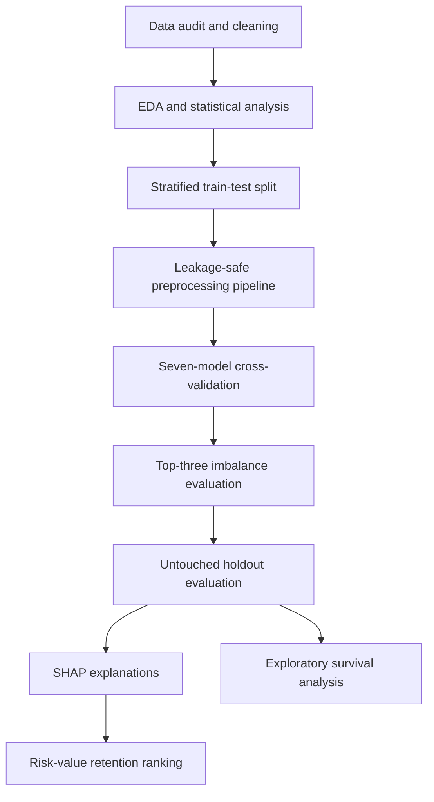

# Explainable Value-Aware Customer Churn Prediction


An end-to-end telecommunications churn analytics project combining machine-learning classification, class-imbalance evaluation, SHAP explainability, customer lifetime value, and exploratory survival analysis to support customer-retention decisions.

## Project Overview

Customer churn reduces recurring revenue and weakens the return on customer-acquisition expenditure. Predicting churn alone is not sufficient: an effective retention system should also explain why a customer is considered at risk and help the business prioritise customers when intervention resources are limited.

This project uses the IBM Telco Customer Churn dataset to:

- compare seven classification algorithms using five-fold stratified cross-validation;
- evaluate the original class distribution, class weighting, and SMOTE-NC;
- prevent data leakage through fold-specific preprocessing and feature selection;
- assess discrimination, minority-class performance, calibration, generalisation, and computational cost;
- explain global and individual predictions using SHAP;
- combine churn probability with IBM’s supplied customer lifetime value (CLTV);
- develop a value-aware customer-retention ranking; and
- explore customer retention duration using Kaplan–Meier and Cox proportional-hazards models.

The final model is selected using cross-validated precision–recall area under the curve (PR-AUC), rather than test-set performance or accuracy alone.

## Research Questions

1. Which classification model provides the strongest cross-validated churn ranking?
2. How do class weighting and SMOTE-NC affect precision, recall, F1, PR-AUC, calibration, and computational cost?
3. Which customer, service, contract, and billing characteristics are most strongly associated with churn?
4. How can predicted churn probability and CLTV be combined to prioritise customer-retention activities?
5. How does observed customer retention vary according to contract type?

## Business Questions

- Which customers are most likely to churn?
- Which at-risk customers represent the greatest potential value loss?
- Which customer groups should be prioritised for retention campaigns?
- What trade-off between missed churners and unnecessary retention offers is acceptable?
- Does the predictive improvement of a complex model justify its additional computational and interpretability costs?

## Dataset

The dataset contains **7,043 customers and 33 variables**. Each row represents one fictional telecommunications customer.

| Variable Group | Examples |
|---|---|
| Identifiers and geography | CustomerID, City, Zip Code, Latitude, Longitude |
| Demographics | Gender, Senior Citizen, Partner, Dependents |
| Services | Internet Service, Online Security, Tech Support, Streaming TV |
| Account and billing | Tenure Months, Contract, Payment Method, Monthly Charges, Total Charges |
| Outcome and business fields | Churn Label, Churn Value, Churn Score, CLTV, Churn Reason |

The binary target is `Churn Value`, where:

- `1` represents churn; and
- `0` represents non-churn.

### Target Distribution

| Class | Customers | Percentage |
|---|---:|---:|
| Non-churn | 5,174 | 73.46% |
| Churn | 1,869 | 26.54% |

The dataset has an approximately **2.77:1 majority-to-minority ratio**. This is a meaningful but not extreme imbalance.

A dummy majority classifier can obtain 73.46% accuracy while detecting no churners. Therefore, accuracy is not used as the primary model-selection metric.

## Data Preparation

The main preparation procedures include:

- checking duplicated rows and customer identifiers;
- converting `Total Charges` from object to numeric format;
- validating the consistency of `Churn Label` and `Churn Value`;
- identifying 11 missing `Total Charges` values belonging to customers with zero tenure;
- excluding constant, high-cardinality, redundant, and leakage-prone variables;
- applying fold-specific numerical and categorical imputation;
- standardising numerical variables;
- one-hot encoding categorical variables; and
- fitting mutual-information feature selection inside the modelling pipeline.

## Leakage Prevention

The following fields are excluded from model training:

| Field | Reason |
|---|---|
| `CustomerID` | Unique identifier without generalisable behavioural meaning |
| `Count`, `Country`, `State` | Constant fields |
| `City`, `Zip Code`, `Lat Long` | High-cardinality or redundant geographic fields |
| `Churn Label` | Exact text equivalent of the target |
| `Churn Score` | Existing model-generated score and direct leakage risk |
| `Churn Reason` | Available only after churn |
| `CLTV` | Reserved for post-prediction prioritisation |

All imputation, encoding, scaling, feature selection, and resampling procedures are learned from training data only.

## Feature Engineering

Four target-independent features are created:

- `Number of Add-on Services`;
- `Number of Streaming Services`;
- `Monthly Charge per Service`; and
- `Tenure Group`.

The final modelling design contains **25 predictors** before one-hot encoding:

- 8 numerical predictors; and
- 17 categorical predictors.

## Project Workflow



## Exploratory Data Analysis

The exploratory analysis covers:

- target-class distribution;
- numerical summary statistics and skewness;
- numerical distributions by churn status;
- categorical churn rates;
- Spearman correlations;
- missing-value analysis; and
- customer-service and billing patterns.

### Main EDA Findings

- Churners have a median tenure of **10 months**, compared with **38 months** among non-churners.
- Churners have higher median monthly charges: **79.65** compared with **64.43**.
- Churners have lower median total charges because they generally have shorter customer tenure.
- Month-to-month customers have a churn rate of **42.7%**.
- Two-year contract customers have a churn rate of only **2.8%**.
- Fibre-optic customers have a churn rate of **41.9%**.
- Electronic-check customers have a churn rate of **45.3%**.
- Customers without online security have a churn rate of **41.8%**.
- Customers without technical support have a churn rate of **41.6%**.

These findings represent descriptive associations and should not be interpreted as causal effects.

## Statistical Analysis

The project uses:

- Mann–Whitney U tests for numerical variables;
- rank-biserial correlation for numerical effect sizes;
- chi-square tests for categorical variables;
- bias-corrected Cramér’s V for categorical effect sizes;
- Holm correction for numerical multiple testing;
- Benjamini–Hochberg false-discovery-rate correction;
- Spearman correlation; and
- mutual information.

### Numerical Statistical Findings

| Feature | Non-Churn Median | Churn Median | Rank-Biserial Effect |
|---|---:|---:|---:|
| Tenure Months | 38.00 | 10.00 | -0.480 |
| Total Charges | 1,683.60 | 703.55 | -0.304 |
| Monthly Charges | 64.43 | 79.65 | 0.242 |
| Longitude | -119.74 | -119.71 | 0.008 |
| Latitude | 36.41 | 36.30 | -0.001 |

Tenure, total charges, and monthly charges are statistically significant after Holm correction. Latitude and longitude are not significant and have negligible effect sizes.

### Categorical Statistical Findings

The strongest categorical associations with churn are:

| Feature | Cramér’s V |
|---|---:|
| Contract | 0.410 |
| Online Security | 0.347 |
| Tech Support | 0.343 |
| Internet Service | 0.322 |
| Payment Method | 0.303 |
| Online Backup | 0.292 |
| Device Protection | 0.281 |
| Dependents | 0.248 |

Gender and phone service do not show statistically significant relationships with churn.

## Machine-Learning Models

Seven classification algorithms are evaluated:

1. Dummy Classifier
2. Logistic Regression
3. Random Forest
4. XGBoost
5. LightGBM
6. CatBoost
7. Multilayer Perceptron

## Experimental Design

The modelling experiment uses:

- an 80:20 stratified train-test split;
- 5,634 training customers;
- 1,409 holdout-test customers;
- five-fold stratified cross-validation;
- random seed `42`;
- mutual-information selection of the top 85% of encoded features;
- fold-specific preprocessing and resampling; and
- an untouched test set for final evaluation.

## Evaluation Metrics

PR-AUC is the primary model-selection metric because it evaluates ranking performance for the minority churn class.

Secondary metrics include:

- ROC-AUC;
- precision;
- recall;
- F1-score;
- accuracy;
- balanced accuracy;
- Brier score;
- training–validation PR-AUC gap;
- model-fitting time;
- inference time; and
- saved model size.

## Baseline Cross-Validation Results

| Model | ROC-AUC | PR-AUC | Precision | Recall | F1 | Brier Score |
|---|---:|---:|---:|---:|---:|---:|
| **Logistic Regression** | **0.8590** | **0.6810** | **0.6720** | 0.5672 | **0.6147** | **0.1300** |
| XGBoost | 0.8566 | 0.6725 | 0.6571 | 0.5478 | 0.5973 | 0.1328 |
| CatBoost | 0.8573 | 0.6701 | 0.6616 | 0.5438 | 0.5967 | 0.1328 |
| MLP | 0.8511 | 0.6630 | 0.6692 | 0.5458 | 0.6007 | 0.1338 |
| Random Forest | 0.8521 | 0.6601 | 0.6677 | 0.5251 | 0.5877 | 0.1339 |
| LightGBM | 0.8475 | 0.6493 | 0.6360 | 0.5304 | 0.5783 | 0.1402 |
| Dummy | 0.5000 | 0.2654 | 0.0000 | 0.0000 | 0.0000 | 0.1949 |

Logistic regression achieves:

- the highest cross-validated PR-AUC;
- the highest cross-validated ROC-AUC;
- the lowest Brier score; and
- the smallest training–validation generalisation gap.

Random Forest and LightGBM achieve high training performance but have substantially larger generalisation gaps, indicating greater overfitting risk.


## Class-Imbalance Evaluation

The three strongest eligible baseline models are evaluated under:

1. the original class distribution;
2. algorithm-level class weighting; and
3. SMOTE-NC oversampling to a 50:50 training distribution.

SMOTE-NC is applied only within each training fold and before one-hot encoding.

### Best Treatment for Each Model

| Model | Selected Treatment | CV PR-AUC | Precision | Recall | F1 |
|---|---|---:|---:|---:|---:|
| **Logistic Regression** | **Original** | **0.6810** | 0.6720 | 0.5672 | 0.6147 |
| XGBoost | Original | 0.6725 | 0.6571 | 0.5478 | 0.5973 |
| CatBoost | Class Weight | 0.6738 | 0.5552 | **0.7773** | **0.6475** |

Class weighting substantially increases recall but reduces precision and worsens probability calibration.

For logistic regression:

- original recall: 0.567;
- class-weighted recall: 0.815;
- original precision: 0.672; and
- class-weighted precision: 0.533.

SMOTE-NC does not improve PR-AUC for any of the three evaluated models. The imbalance treatments primarily change the precision–recall operating point instead of consistently improving ranking quality.

## Holdout-Test Results

| Model | Treatment | ROC-AUC | PR-AUC | Precision | Recall | F1 | Brier |
|---|---|---:|---:|---:|---:|---:|---:|
| Logistic Regression | Original | 0.8478 | 0.6474 | 0.6478 | 0.5508 | 0.5954 | 0.1361 |
| XGBoost | Original | 0.8523 | **0.6688** | **0.6548** | 0.5428 | 0.5936 | **0.1337** |
| CatBoost | Class Weight | **0.8527** | 0.6671 | 0.5347 | **0.7620** | **0.6284** | 0.1537 |

XGBoost records the highest holdout PR-AUC, while class-weighted CatBoost provides the strongest recall and F1 at the default threshold.

Nevertheless, logistic regression remains the final champion because the model-selection procedure was based on cross-validation rather than test-set performance. Changing the selected model after observing the test results would turn the holdout set into an additional validation set and produce an optimistic performance estimate.


## Champion Model

The selected champion is:

> **Logistic Regression trained on the original class distribution**

### Champion Performance

| Measure | Result |
|---|---:|
| Test Accuracy | 0.8013 |
| Test Balanced Accuracy | 0.7213 |
| Test ROC-AUC | 0.8478 |
| Test PR-AUC | 0.6474 |
| Churn Precision | 0.6478 |
| Churn Recall | 0.5508 |
| Churn F1 | 0.5954 |
| Brier Score | 0.1361 |
| Final Fit Time | 2.39 seconds |
| Model Size | 0.011 MB |

### Confusion Matrix

|  | Predicted Non-Churn | Predicted Churn |
|---|---:|---:|
| Actual Non-Churn | 923 | 112 |
| Actual Churn | 168 | 206 |

At the default 0.50 threshold, the champion correctly identifies 206 of 374 churners.

The selected threshold is relatively conservative:

- approximately 65% of flagged customers are actual churners;
- approximately 55% of all churners are detected; and
- approximately 45% of churners are missed.

A lower threshold or class-weighted model may be more appropriate when missing a churner is more expensive than contacting a non-churner.

## Learning-Curve Analysis

The training PR-AUC decreases from approximately 0.717 to 0.686 as the training sample grows, while validation PR-AUC increases from approximately 0.651 and stabilises around 0.67–0.68.

The narrowing training–validation gap indicates that logistic regression does not exhibit severe overfitting. Validation performance begins to plateau after approximately 1,200–1,800 training observations.

This suggests that richer longitudinal and behavioural features may provide greater improvement than simply increasing model complexity.

## SHAP Explainability

SHAP provides global and individual explanations for the champion model.

The most influential individual feature is customer tenure. Low tenure generally increases predicted churn probability, while longer tenure reduces it.

Other influential predictors include:

- dependent status;
- month-to-month contract;
- number of streaming services;
- monthly charges;
- internet-service type;
- two-year contract;
- partner status;
- total charges; and
- paperless billing.


The highest-risk sampled customer has a predicted churn probability of approximately **0.865**. Very low tenure is the strongest upward contributor, followed by month-to-month contract status and early-tenure membership.

SHAP explains how the fitted model generates predictions. It does not establish that changing a feature will cause churn to decrease.

## Value-Aware Retention Prioritisation

Customer prioritisation is based on:

$$
\text{Value at Risk}_i =
\widehat{P}(\text{Churn}_i=1)
\times
\text{CLTV}_i
$$

A customer is classified as:

- high risk when predicted churn probability is at least 0.50; and
- high value when CLTV is at least the training-set median.

### Retention Segments

| Segment | Customers | Mean Churn Probability | Mean CLTV | Total Value at Risk | Suggested Action |
|---|---:|---:|---:|---:|---|
| Priority Retention | 116 | 0.6625 | 5,278 | 405,234 | Personalised high-touch intervention |
| Efficient Retention | 202 | 0.6697 | 3,201 | 432,987 | Scalable, lower-cost retention offers |
| Loyalty Monitoring | 587 | 0.1301 | 5,393 | 409,164 | Service monitoring and loyalty support |
| Standard Management | 504 | 0.1732 | 3,481 | 295,505 | Routine customer management |


The **Priority Retention** segment contains high-risk, high-value customers who should receive personalised retention support.

The **Efficient Retention** segment has the largest aggregate value exposure and may be suitable for scalable digital offers.

The value-at-risk calculation is a prioritisation heuristic rather than a complete expected-profit model. A production system should also incorporate:

- customer contribution margin;
- intervention cost;
- offer-acceptance probability;
- probability that the intervention prevents churn; and
- expected incremental retained value.

## Exploratory Survival Analysis

Kaplan–Meier and Cox proportional-hazards models are used to explore customer retention across observed tenure.

### Kaplan–Meier Findings

The overall retention curve declines most rapidly during the early customer period. This is consistent with the classification and statistical findings showing that churners have substantially shorter tenure.

Contract-level curves show that:

- month-to-month customers have the steepest retention decline;
- one-year customers have substantially higher retention; and
- two-year customers maintain the highest estimated retention.

The global log-rank test indicates that the contract-specific retention curves differ significantly:

- test statistic: **2,352.87**;
- `p < 0.001`.

### Cox Proportional-Hazards Findings

Month-to-month contract is used as the reference group.

| Predictor | Hazard Ratio | Interpretation |
|---|---:|---|
| One-year contract | 0.24 | Approximately 76% lower observed hazard |
| Two-year contract | 0.11 | Approximately 89% lower observed hazard |
| Dependents | 0.42 | Approximately 58% lower observed hazard |
| Partner | 0.64 | Approximately 36% lower observed hazard |
| Senior Citizen | 1.06 | Not statistically significant |
| Monthly Charges | Approximately 1.00 | Not statistically significant |

The Cox model has a concordance index of **0.81**.

These survival findings remain exploratory because the dataset is a synthetic cross-sectional snapshot rather than a prospectively observed longitudinal cohort.

## Computational Trade-Off

| Model | Test PR-AUC | Fit Time | Inference per Row | Model Size |
|---|---:|---:|---:|---:|
| Logistic Regression | 0.6474 | **2.39 s** | **0.107 ms** | **0.011 MB** |
| XGBoost | **0.6688** | 5.83 s | 0.181 ms | 0.451 MB |
| CatBoost | 0.6671 | 9.68 s | 0.118 ms | 0.334 MB |

Logistic regression provides the strongest balance of:

- cross-validated performance;
- generalisation stability;
- probability calibration;
- interpretability;
- training speed; and
- model size.

XGBoost provides a small holdout ranking improvement but has higher computational and interpretability costs.

Runtime measurements are hardware-dependent and should be interpreted as relative comparisons within the experimental environment.

## Repository Structure

```text
customer-churn-prediction/
├── IBM_Customer_Churn_Prediction.ipynb
├── README.md
├── dataset/
│   └── IBM_Telco_customer_churn_IBM_dataset.csv
└── outputs/
    ├── figures/
    ├── models/
    ├── processed/
    └── results/
```

For the images in this README to appear on GitHub, copy the generated figures into `outputs/figures/` in the repository.

## Running the Project

### Google Colab

1. Clone or download the repository.
2. Upload `IBM_Customer_Churn_Prediction.ipynb` to Google Colab.
3. Place the dataset at:

   ```text
   /content/drive/MyDrive/IBM_Telco_Customer_Churn/dataset/IBM_Telco_customer_churn_IBM_dataset.csv
   ```

4. Run the notebook from top to bottom.
5. If the dataset cannot be found, the notebook will request a one-time upload.
6. The results will be saved under:

   ```text
   /content/drive/MyDrive/IBM_Telco_Customer_Churn/outputs/
   ```

The notebook automatically creates separate directories for:

- processed data;
- fitted models;
- result tables; and
- figures.

## Main Dependencies

```bash
pip install pandas numpy scipy scikit-learn imbalanced-learn \
    xgboost lightgbm catboost shap lifelines statsmodels \
    matplotlib seaborn joblib
```

## Reproducibility Controls

- Fixed random seed: `42`
- Stratified 80:20 train-test split
- Five-fold stratified cross-validation
- Untouched holdout test set
- Fold-specific imputation and preprocessing
- Training-fold-only SMOTE-NC
- Fold-specific mutual-information feature selection
- Checkpointed cross-validation results
- Saved fitted pipelines
- Generated reproducibility manifest
- Generated artifact inventory

## Business Recommendations

1. Prioritise high-risk, high-value customers for personalised retention activities.
2. Use lower-cost digital interventions for high-risk, lower-value customers.
3. Focus diagnostic attention on early-tenure and month-to-month customers.
4. Investigate the experiences of fibre-optic and electronic-check customers.
5. Promote online security and technical support where appropriate.
6. Select the classification threshold using campaign cost and expected customer value.
7. Monitor probability calibration and customer-population drift after deployment.
8. Validate retention strategies through controlled experiments rather than assuming observational relationships are causal.

## Limitations

- The IBM dataset is synthetic and cross-sectional.
- The customer population may not represent another provider, geography, or time period.
- Longitudinal usage, complaints, network quality, and interaction history are unavailable.
- Campaign exposure, intervention cost, realised profit, and treatment outcomes are unavailable.
- The supplied CLTV field is not independently validated.
- Hyperparameter and classification-threshold optimisation are limited.
- SHAP explanations describe model behaviour rather than causal mechanisms.
- Survival-analysis assumptions cannot be fully validated using the available temporal information.

## Future Work

Future extensions could:

- validate the model using external or temporal telecommunications data;
- optimise the classification threshold using campaign costs and expected retained value;
- apply probability recalibration and population-drift monitoring;
- include longitudinal usage, complaint, and service-quality variables;
- use uplift modelling to identify customers whose churn can be prevented;
- evaluate model fairness across customer groups;
- test retention strategies using controlled experiments; and
- deploy the fitted pipeline using Streamlit, Flask, or a REST API.

## Conclusion

This project demonstrates that a comparatively simple logistic regression model can provide competitive churn prediction, stable generalisation, calibrated probabilities, compact deployment, and transparent explanations.

Class weighting substantially increases churn recall but reduces precision and probability calibration. SMOTE-NC does not improve PR-AUC for the evaluated models. Therefore, the best imbalance treatment depends on the business cost of missed churners compared with unnecessary retention contacts.

The primary contribution is an integrated decision-support framework that connects:

- rigorous predictive-model comparison;
- leakage-safe imbalance evaluation;
- explainable artificial intelligence;
- customer lifetime value;
- computational considerations; and
- customer-retention prioritisation.

The results indicate that short tenure, month-to-month contracts, limited support services, and selected billing characteristics are strongly associated with churn. However, practical retention decisions should incorporate customer value, intervention cost, model calibration, and the limitations of observational data.

---

